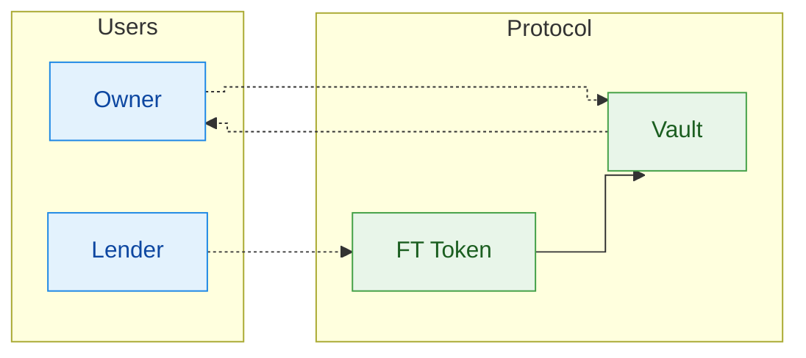

# Open your first liquidity request

This guide is grounded in the actual source code of both repos and follows the contract flow as specified in sudostake_contracts_near/value_flows.md.

Prerequisites

- A NEAR wallet with some NEAR for gas and fees
- A minted Vault on the selected network (testnet by default)
- Optional: delegated stake in your Vault to serve as collateral (only staked NEAR counts; liquid NEAR does not)

1) Create or open your Vault
- If you don’t have a Vault, mint one via the Factory (the UI guides you through this). The Factory creates `vault-<index>.<factory_id>` and deploys/initializes it. The factory emits an `EVENT_JSON` log with `event: "vault_minted"` that the UI parses to determine your new vault account ID.
- If you already have a Vault, open Dashboard → your Vault.

2) Fund your Vault (optional, recommended)
- Send NEAR directly to your Vault account to increase its liquid balance. Note: liquid NEAR does not count toward collateral.
- Delegate to validators from your Vault to build collateral. Only staked balance counts toward collateral checks.

3) Open a liquidity request (what the UI sends and the contract checks)
- UI signs a transaction to your vault calling `request_liquidity` with:
  - gas: `300 Tgas` and deposit: `1 yoctoNEAR`
  - args: `{ token, amount, interest, collateral, duration }`
    - `token`: NEP‑141 contract ID (on testnet the default is `usdc.tkn.primitives.testnet`, 6 decimals)
    - `amount` and `interest`: provided in token display units in the dialog; the UI converts to minimal units based on token decimals
    - `collateral`: provided in NEAR; the UI converts to yoctoNEAR
    - `duration`: provided in days; the UI converts to seconds (days × 86400)
- Contract side constraints (vault/src/request_liquidity.rs):
  - Only the vault owner may call; must attach exactly 1 yoctoNEAR
  - No other async workflow may be in progress and no existing liquidity request or accepted offer may exist; counter offers must be cleared
  - Inputs must be valid: `collateral > 0`, `amount > 0`, `duration > 0`
  - The contract acquires a lock, then batch‑queries total staked balance across active validators
  - If total staked < `collateral`: it logs `liquidity_request_failed_insufficient_stake` and releases the lock without opening a request
- Otherwise it opens the request, logs `liquidity_request_opened` (including token, amount, interest, collateral, duration) and records `created_at = block_timestamp()` (nanoseconds). Liquid NEAR is ignored for this collateral check; only delegated (staked) balance is counted.

After submission, the UI enqueues indexing and triggers a direct index of your vault’s state via `/api/index_vault`. The indexer fetches `get_vault_state` from the chain and stores it. Your request will appear after indexing completes. If staked balance was insufficient, the request won’t appear because it was not opened by the contract.

4) Lender proposals and direct acceptance (reference)
- Lenders send `ft_transfer_call` to the requested token with one of these messages:
  - `NewCounterOffer` — creates a counter offer for the owner to consider
  - `AcceptLiquidityRequest` — directly accepts the open request

5) Owner selects the winning offer (reference)
- The Owner may accept a single counter offer. Non‑winning proposers are refunded by the vault.

Reference diagram (from contracts repo)

Notes

- Keep collateral conservative relative to the requested amount to avoid liquidation risk.
- The UI attaches safe gas and the required 1 yoctoNEAR deposit for `request_liquidity`.
- Duration is stored in seconds; acceptance timestamps are in nanoseconds on-chain.
- For repayment and liquidation flows, see the contracts repo sections “Repay” and “Liquidation (after expiry, NEAR out)”.

